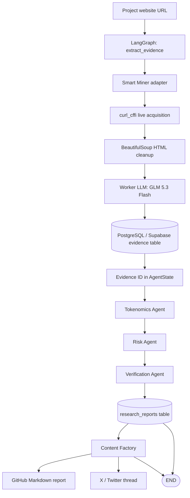

# AGInaz DePIN Research Agent

> An evidence-first, multi-agent research pipeline for investigating DePIN projects and producing reusable research deliverables.

## Architecture Understanding

- This is the third project in the AGInaz portfolio; it is separate from AGInaz Smart Miner.
- A project website URL is the workflow input.
- The local Smart Miner adapter acquires and cleans live page content, then uses a low-cost LLM to prepare the evidence text.
- Evidence is persisted in PostgreSQL before specialist analysis begins.
- LangGraph runs Tokenomics, Risk, Verification, persistence, and Content Factory nodes.
- Specialist agents retrieve source evidence by database ID instead of carrying raw page content in graph state.
- The verified research object is persisted and then converted into a GitHub Markdown report and an English X/Twitter thread.
- Existing repository outputs demonstrate runs for Grass, Bless Network, DAWN Internet, and Teneo Protocol.

## 1. Project Overview

AGInaz DePIN Research Agent is a Python and LangGraph research system that turns a live DePIN project website into evidence-backed analysis and portfolio-ready content.

The project addresses a practical research problem: DePIN websites often combine technical claims, reward mechanics, token information, and marketing language in unstructured pages. The pipeline captures the source material, stores it as evidence, runs focused analytical agents, checks selected claims against that evidence, and produces reusable deliverables.

This repository is the **DePIN intelligence and content-generation project**. It is not the standalone AGInaz Smart Miner project. Its `tools/smart_miner_adapter.py` module provides the acquisition boundary used by this workflow.

The repository is positioned as a portfolio and freelance-research system. Its concrete deliverables are:

- structured tokenomics findings;
- structured risk findings;
- claim-verification results with confidence scores and source quotes;
- persisted research records;
- GitHub-ready Markdown reports; and
- English X/Twitter research threads.

## 2. Architecture

The current architecture follows an evidence-first sequence.

1. `main.py` creates the initial graph state with a target URL and project ID.
2. The extraction node calls the local Smart Miner adapter.
3. The adapter requests the page with Chrome browser impersonation, removes non-content HTML elements, normalizes the text to ASCII, and asks the configured worker model to extract the project's core information.
4. The resulting content is saved in the PostgreSQL `evidence` table.
5. Only the evidence ID is carried forward. Tokenomics and Risk agents retrieve the stored evidence independently.
6. The Verification Agent compares selected findings with the stored source content.
7. The verified research object is saved in `research_reports`.
8. The Content Factory writes a Markdown report and an X/Twitter thread to `output_threads/`.

`AgentState` intentionally carries references and structured results rather than raw HTML or full page text.

## 3. Architecture Diagram



> The diagram includes both outgoing paths currently registered from `persist_research`: a direct `END` edge and an edge to `twitter_factory`. This reflects the graph definition in the repository rather than an inferred design.

## 4. Core Features

### Live DePIN website acquisition

The adapter uses `curl_cffi.requests.AsyncSession` with Chrome 120 impersonation and a 30-second timeout. It accepts a project URL, checks for an HTTP 200 response, and extracts page content.

### HTML cleanup and text normalization

BeautifulSoup removes `script`, `style`, `nav`, `footer`, `noscript`, `header`, and `aside` elements. The remaining text is flattened and converted to ASCII before LLM processing.

### Dual-model LLM routing

`core/llm_router.py` routes calls through an OpenAI-compatible endpoint:

- `cheap` role: `z-ai/glm-5.3-flash` by default;
- `main` role: `deepseek/deepseek-v4-flash-0731` by default;
- default gateway: OpenRouter.

The worker model prepares extracted website content. The main model performs tokenomics analysis, risk analysis, verification, and content generation.

### Evidence-first persistence

Extracted content is stored before downstream analysis. Specialist agents receive an evidence ID and retrieve the associated record from PostgreSQL when needed.

### Tokenomics Agent

The Tokenomics Agent requests a JSON object containing available token details such as token name, total supply, utility, and distribution. Parsing failures are preserved as structured error findings.

### Risk Agent

The Risk Agent asks the main model to identify technical, economic, centralization, and red-flag risks from stored evidence. Its response is parsed as JSON and added to the shared structured findings.

### Verification Agent

The Verification Agent condenses the tokenomics findings and selected technical risks/red flags, then evaluates three major claims against the stored evidence. Its expected result includes:

- claim text;
- `supported`, `partially_supported`, or `unsupported` status;
- confidence score; and
- a short source quote.

If model output cannot be parsed, the current implementation returns a rule-based fallback verification result.

### Research persistence

The persistence node writes tokenomics, risk analysis, and verification JSON to the `research_reports` table, linked to the evidence record.

### Content Factory

The Content Factory converts structured research into two freelance- and portfolio-oriented deliverables:

1. an English investigative X/Twitter thread; and
2. a GitHub Markdown report containing tokenomics, risk analysis, and verification sections.

Thread generation includes a simplified retry prompt when the primary LLM response is empty.

## 5. Pipeline

```text
Target URL
  -> live page acquisition
  -> HTML cleanup and text normalization
  -> worker-model content preparation
  -> evidence persistence
  -> Tokenomics Agent
  -> Risk Agent
  -> Verification Agent
  -> verified research persistence
  -> Content Factory
  -> Markdown report + X/Twitter thread
```

The current LangGraph node order is:

```text
extract_evidence
  -> tokenomics
  -> risk
  -> verification
  -> persist_research
  -> twitter_factory
  -> END
```

The graph file also contains a direct `persist_research -> END` edge.

## 6. Technology Stack

| Area | Repository implementation |
|---|---|
| Language | Python |
| Workflow orchestration | LangGraph |
| LLM integration | LangChain OpenAI-compatible `ChatOpenAI` |
| LLM gateway | OpenRouter-compatible endpoint |
| Worker model | `z-ai/glm-5.3-flash` default |
| Main model | `deepseek/deepseek-v4-flash-0731` default |
| Web acquisition | `curl_cffi` with Chrome impersonation |
| HTML parsing | BeautifulSoup |
| Database | PostgreSQL / Supabase connection via `DATABASE_URL` |
| Database driver | `psycopg2` |
| Vector extension | pgvector is enabled by the setup script |
| Graph state | Python `TypedDict` |
| Structured interchange | JSON |
| Content outputs | Markdown and plain-text X/Twitter threads |

The database setup creates `projects`, `evidence`, and `whitepaper_claims`. The current pipeline additionally writes to `research_reports`; creation of that table is not present in `database/db_setup.py` and must already exist in the connected database.

## 7. Project Structure

```text
DePIN_Research_Agent/
├── agents/
│   ├── graph.py                # LangGraph nodes, edges, and compilation
│   ├── state.py                # Shared graph-state contract
│   ├── tokenomics_agent.py     # Token and reward analysis
│   ├── risk_agent.py           # Technical, economic, and centralization risks
│   ├── verification_agent.py   # Claim-to-evidence verification
│   ├── persist_agent.py        # Final research-object persistence
│   └── twitter_agent.py        # Content Factory and output generation
├── core/
│   ├── llm_router.py           # Worker/main model selection
│   └── repositories.py         # Evidence and report database operations
├── database/
│   └── db_setup.py             # PostgreSQL tables and pgvector setup
├── tools/
│   └── smart_miner_adapter.py  # Live acquisition and content preparation
├── output_threads/             # Recorded reports and social threads
├── check_db.py                 # Reads the latest three evidence records
├── main.py                     # Current executable entry point
├── requirements.txt            # Declared Python dependencies
└── README.md
```

## 8. Execution / Usage

### Prerequisites

- Python
- a reachable PostgreSQL/Supabase database;
- an OpenRouter-compatible API key; and
- network access to the target project website and LLM gateway.

The exact supported Python version is **not documented in the current repository**.

### Install declared dependencies

```bash
python -m venv venv
```

Windows PowerShell:

```powershell
venv\Scripts\Activate.ps1
pip install -r requirements.txt
```

`tools/smart_miner_adapter.py` imports `curl_cffi`, but `curl_cffi` is not currently declared in `requirements.txt`. Install it separately for the current code:

```powershell
pip install curl-cffi
```

### Environment variables

Create a local `.env` file in the project root with these variable names:

```env
OPENROUTER_API_KEY=your_key
LLM_BASE_URL=https://openrouter.ai/api/v1
TARGET_MODEL=deepseek/deepseek-v4-flash-0731
CHEAP_MODEL=z-ai/glm-5.3-flash
DATABASE_URL=your_postgresql_connection_string
```

Do not commit credentials.

### Initialize the database

```powershell
python database/db_setup.py
```

This creates the `projects`, `evidence`, and `whitepaper_claims` tables and enables pgvector. The pipeline also expects:

- an existing project record with ID `1`; and
- an existing `research_reports` table compatible with the insert in `core/repositories.py`.

The schema or migration for `research_reports` was **not found in the current repository**.

### Select a target

The current target is defined directly in `main.py`:

```python
target_url = "https://teneo.pro/"
```

A CLI argument, web interface, or external configuration mechanism for selecting the target was **not found in the current repository**.

### Run the workflow

From the project root:

```powershell
python main.py
```

Generated content is written to:

```text
output_threads/<domain>_GitHub_Report.md
output_threads/<domain>_thread.txt
```

### Inspect recent evidence

```powershell
python check_db.py
```

This prints the latest three records from the `evidence` table.

## 9. Current Status

The repository contains an implemented end-to-end DePIN research and content-generation workflow. Recorded outputs exist for:

- Grass;
- Bless Network;
- DAWN Internet; and
- Teneo Protocol.

Those artifacts demonstrate the intended deliverable format: structured research reports plus investigative social threads.

The following repository limitations are also present:

- automated tests were not found;
- `curl_cffi` is imported but absent from `requirements.txt`;
- the setup script does not create the `research_reports` table used by the pipeline;
- `save_evidence()` currently writes project ID `1` regardless of the function argument;
- the target URL is hard-coded in `main.py`;
- the graph registers both `persist_research -> END` and `persist_research -> twitter_factory`;
- no CLI, API, package entry point, CI workflow, or deployment configuration was found; and
- a license file was not found.

The previous repository documentation described the project as a **Production-ready MVP / Portfolio Release Candidate**. The recorded outputs support its portfolio demonstration use, but production-readiness criteria, automated validation, and deployment documentation were not found in the current repository.

## 10. Future Scope

The previous README documented the following future directions; they are not implemented as current features:

- a Promoter Agent for evidence-grounded positive project analysis;
- additional specialized research agents;
- additional verification strategies;
- richer research objects;
- additional professional output formats; and
- expanded DePIN project coverage.

No implementation schedule is documented in the current repository.

## Existing Research Artifacts

The repository includes paired Markdown and X/Twitter outputs in `output_threads/` for four DePIN projects. These files provide concrete portfolio examples for freelance research, technical due diligence, risk analysis, and content-generation work.

## Portfolio Context

AGInaz DePIN Research Agent is the third project in a three-project AGInaz portfolio:

1. Telegram bot project;
2. AGInaz Smart Miner; and
3. AGInaz DePIN Research Agent.

Smart Miner provides extraction capability. This repository adds evidence persistence, specialist analysis, verification, and the Content Factory required to turn research into client-facing deliverables.

---

**Evidence first. Analyze second. Verify third. Publish last.**
